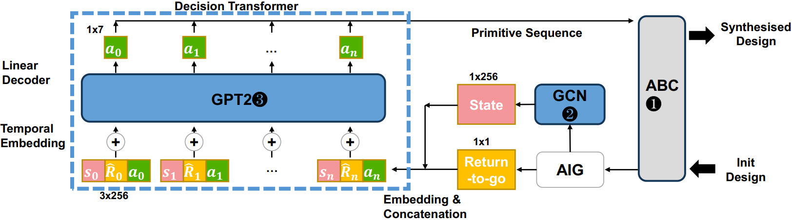

# GPT-LS: Generative Pre-Trained Transformer with Off-line Reinforcement Learning for Logic Synthesis
[](https://github.com/NYU-MLDA/OpenABC) 
[](https://opensource.org/licenses/BSD-3-Clause)

<p align="center">
      
</p>

## Overview

**GPT-LS** is a new algorithm developed to optimize logic synthesis (LS) in electronic design automation (EDA). LS is a process that transforms a high-level circuit description into a gate-level netlist, typically utilizing a unified heuristic algorithm to optimize various combinational circuits. The GPT-LS model uses decision transformer (DT), a form of offline reinforcement learning, to generate a primitive sequence (PS) that achieves design goals in a shorter time compared to traditional machine learning-based approaches. GPT-LS has been trained on a large-scale logic synthesis dataset and has achieved results that match those of previous state-of-the-art (SOTA) methods in a significantly shorter time.


## Environment

We recommend using [venv](https://docs.python.org/3/library/venv.html) or [Anaconda](https://www.anaconda.com/) environment to install pre-requisites packages for running our framework and models.
We list down the packages which we used on our side for experimentations. We recommend installing the packages using *requirements.txt* file provided in our repository.

- cudatoolkit = 10.1
- numpy >= 1.20.1
- pandas >= 1.2.2
- pickleshare >= 0.7.5
- python >=3.9
- pytorch = 1.8.1
- scikit-learn = 0.24.1
- torch-geometric=1.7.0
- tqdm >= 4.56
- seaborn >= 0.11.1
- networkx >= 2.5
- joblib >= 1.1.0

Here are few resources to install the packages (if not using *requirements.txt*)

- [Pytorch](https://pytorch.org/get-started/locally/)
- [Torch-geometric](https://pytorch-geometric.readthedocs.io/en/latest/notes/installation.html)
- [Networkx](https://networkx.org/documentation/stable/install.html)
- [berkeley-ABC](https://github.com/berkeley-abc/abc)
- [EPFL-benchmark](https://github.com/lsils/benchmarks)

## Run Example

```shell script
/bin/bash auto_run_DT.sh
```


## Cite Us

```
@misc{chenyang2023gptls,
      title={GPT-LS: Generative Pre-Trained Transformer with Off-line Reinforcement Learning for Logic Synthesiss}, 
      author={Chenyang Lv, Ziling Wei, Weikang Qian, Junjie Ye, Chang Feng, Zhezhi He},
      booktitle={40th International Conference on Computer Design (ICCD)},
      year={2023},
      organization={IEEE}
}
```


